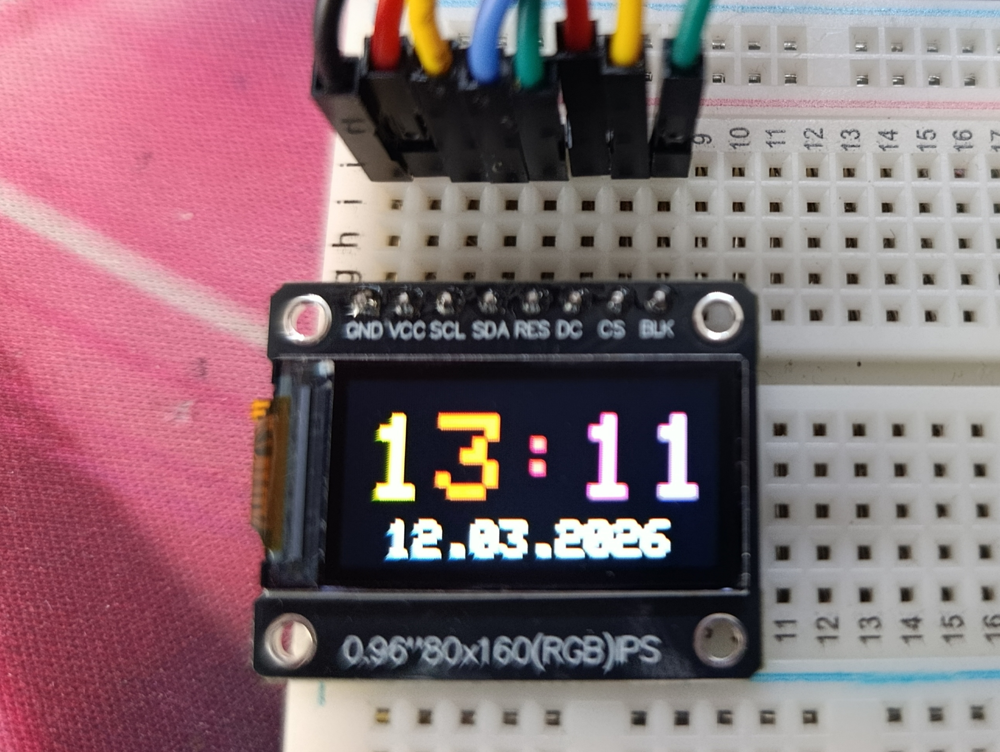

[](https://www.espressif.com/)
[](https://www.aliexpress.com/item/1005006703049804.html)
[](https://opensource.org/licenses/MIT)

# Документация проекта: Радужные часы на ESP32-C3 и дисплее ST7735

## О проекте

Этот проект представляет собой красивые часы с радужными цифрами на черном фоне, работающие на базе микроконтроллера ESP32-C3 Super Mini и дисплея ST7735 (80x160 пикселей). Часы подключаются к Wi-Fi, синхронизируют время через NTP и отображают его крупными переливающимися всеми цветами радуги цифрами.

Проект создан совместно пользователем и **DeepSeek** — искусственным интеллектом, который помогал писать код, отлаживать проблемы с ориентацией дисплея, добавлять визуальные эффекты и оптимизировать производительность. Мы прошли долгий путь от простого вывода времени до красивых анимированных часов!

## ✨ Особенности

- 🕐 **Огромные цифры** — время занимает почти весь экран
- 🌈 **Радужная анимация** — каждый символ переливается своим цветом
- ⚫ **Черный фон** — идеальный контраст и экономия энергии
- 📅 **Полная дата** — отображается число, месяц и год
- 🌐 **Автосинхронизация** — точное время через NTP
- 🔧 **Легкая настройка** — только Wi-Fi и часовой пояс
- ⚡ **Оптимизировано** — минимальное мерцание, плавная работа

---

## Ссылка на дисплей

Используемый дисплей: [ST7735 0.96" 80x160 RGB LCD на AliExpress](https://aliexpress.ru/item/1005006703049804.html?spm=a2g2w.orderdetail.0.0.2ad54aa66Mc0YH&sku_id=12000056542130758&_ga=2.2120176.1997485394.1773301366-1328442814.1772210220)

**Характеристики дисплея:**

- Разрешение: 80x160 пикселей
    
- Контроллер: ST7735S
    
- Интерфейс: SPI
    
- Напряжение: 3.3V
    
- Цветность: 16-bit RGB (65K цветов)
    

---

## Схема подключения

| Дисплей (ST7735) | ESP32-C3 Super Mini | Примечание                  |
| ---------------- | ------------------- | --------------------------- |
| GND              | GND                 | Общий провод                |
| VCC              | 3.3V                | Питание                     |
| SCL              | GPIO4               | SPI Clock                   |
| SDA              | GPIO5               | SPI MOSI                    |
| RES              | GPIO3               | Reset                       |
| DC               | GPIO2               | Data/Command                |
| CS               | GPIO7               | Chip Select                 |
| BLK              | GPIO8               | Подсветка (HIGH - включена) |
|                  |                     |                             |

## 🛠️ Компоненты

| Компонент              | Название            | Примечание                 |
| ---------------------- | ------------------- | -------------------------- |
| Микроконтроллер        | ESP32-C3 Super Mini | Компактная плата с Wi-Fi   |
| Дисплей                | ST7735 0.96" 80x160 | SPI интерфейс, 16-bit цвет |
| Соединительные провода | Dupont              | Мама-мама                  |

**Важно:** Все подключения должны быть только к 3.3V! Не используйте 5V.

---

## Полный код с подробными комментариями

cpp

```
//===========================================================
// Проект: Радужные часы на ESP32-C3 super mini и дисплее ST7735
// Авторы: Пользователь и DeepSeek
// Версия: 1.0
// Дата: 2026
// Описание: Часы с крупными радужными цифрами на черном фоне,
//  Синхронизация времени по NTP, плавное переливание цветов
//===========================================================
// Подключаем необходимые библиотеки
#include <WiFi.h>              // Для работы с Wi-Fi
#include <NTPClient.h>          // Для получения времени по NTP
#include <WiFiUdp.h>            // Для UDP соединения (нужен NTPClient)
#include <Adafruit_GFX.h>       // Графическая библиотека Adafruit
#include <Adafruit_ST7735.h>    // Библиотека для дисплея ST7735
#include <SPI.h>                // Для SPI интерфейса
#include <Fonts/FreeSansBold12pt7b.h>  // Жирный шрифт (опционально)
// ========== РАЗРЕШЕНИЕ ДИСПЛЕЯ ==========
// Важно! Из-за особенностей ориентации (rotation 3) 
// ширина и высота меняются местами
#define TFT_WIDTH  160  // Фактическая ширина в данной ориентации
#define TFT_HEIGHT 80   // Фактическая высота в данной ориентации
// ========== СМЕЩЕНИЕ ЭКРАНА ==========
// Компенсирует сдвиг изображения при rotation 3
// Подобрано экспериментально для полного заполнения экрана
#define Y_OFFSET 25
// ========== НАСТРОЙКИ Wi-Fi ==========
// Введите данные вашей Wi-Fi сети
const char* ssid = "YOUR WIFI NAME";
const char* password = "YOUR WIFI PASS";
// ========== НАСТРОЙКИ ДИСПЛЕЯ ==========
// Пины подключения согласно схеме выше
#define TFT_CS    7   // Chip Select
#define TFT_DC    2   // Data/Command
#define TFT_RST   3   // Reset
#define TFT_BL    8   // Backlight (подсветка)
// Создаем объект дисплея
Adafruit_ST7735 tft = Adafruit_ST7735(TFT_CS, TFT_DC, TFT_RST);
// ========== НАСТРОЙКИ ВРЕМЕНИ ==========
WiFiUDP ntpUDP;  // Для NTP
const long utcOffsetInSeconds = 14400;  // Смещение для Ульяновска (UTC+4)
NTPClient timeClient(ntpUDP, "pool.ntp.org", utcOffsetInSeconds);
// ========== ПЕРЕМЕННЫЕ ==========
String currentTime = "--:--";        // Текущее время (ЧЧ:ММ)
String currentDate = "01.01.1970";    // Текущая дата (ДД.ММ.ГГГГ)
int hueOffset = 0;                    // Смещение для анимации цветов
// ========== ФУНКЦИЯ ПРЕОБРАЗОВАНИЯ HSV В RGB565 ==========
// Преобразует цвет из модели HSV (оттенок) в RGB565
// Параметры: h - оттенок (0-359)
// Возвращает: 16-битный цвет в формате RGB565
uint16_t hsvToRgb565(int h) {
  byte r, g, b;
  int region, remainder;
  
  h = h % 360;  // Нормализуем оттенок
  
  // Разбиваем цветовой круг на 6 регионов
  if (h < 120) {
    region = h / 60;
    remainder = h % 60;
    if (region == 0) { r = 255; g = remainder * 4.25; b = 0; }
    if (region == 1) { r = 255 - remainder * 4.25; g = 255; b = 0; }
  } else if (h < 240) {
    h -= 120;
    region = h / 60;
    remainder = h % 60;
    if (region == 0) { r = 0; g = 255; b = remainder * 4.25; }
    if (region == 1) { r = 0; g = 255 - remainder * 4.25; b = 255; }
  } else {
    h -= 240;
    region = h / 60;
    remainder = h % 60;
    if (region == 0) { r = remainder * 4.25; g = 0; b = 255; }
    if (region == 1) { r = 255; g = 0; b = 255 - remainder * 4.25; }
  }
  
  // Конвертируем 8-битные RGB в 16-битный RGB565
  return ((r & 0xF8) << 8) | ((g & 0xFC) << 3) | (b >> 3);
}
// ========== ФУНКЦИЯ РИСОВАНИЯ РАДУЖНОГО ТЕКСТА ==========
// Рисует текст, где каждый символ имеет свой цвет
// Параметры:
//   text - строка для вывода
//   x, y - координаты начала
//   textSize - размер шрифта (1-5)
void drawRainbowText(String text, int x, int y, int textSize) {
  tft.setTextSize(textSize);
  
  for (int i = 0; i < text.length(); i++) {
    // Каждый символ имеет свой оттенок, смещенный во времени
    int hue = (i * 30 + hueOffset) % 360;
    tft.setTextColor(hsvToRgb565(hue));
    tft.setCursor(x + i * (6 * textSize), y);
    tft.print(text.charAt(i));
  }
}
// ========== ФУНКЦИЯ ОТОБРАЖЕНИЯ ВРЕМЕНИ ==========
// Оптимизирована для уменьшения мерцания
void displayTime() {
  // Статические переменные сохраняют значения между вызовами
  static String lastTime = "";
  static String lastDate = "";
  
  String hourStr = currentTime.substring(0, 2);
  String minuteStr = currentTime.substring(3, 5);
  String fullTime = hourStr + ":" + minuteStr;
  
  // Обновляем смещение цвета для анимации (плавное переливание)
  hueOffset = (hueOffset + 2) % 360;
  
  // ВСЕГДА перерисовываем время (для анимации цветов)
  // Но очищаем только область времени, а не весь экран
  tft.fillRect(0, 10 + Y_OFFSET, TFT_WIDTH, 45, ST77XX_BLACK);
  drawRainbowText(fullTime, 10, 15 + Y_OFFSET, 5);
  
  // ДАТУ перерисовываем ТОЛЬКО если она изменилась
  // Это экономит ресурсы и уменьшает мерцание
  if (currentDate != lastDate) {
    // Очищаем только область даты
    tft.fillRect(0, 55 + Y_OFFSET, TFT_WIDTH, 20, ST77XX_BLACK);
    
    tft.setTextColor(ST77XX_WHITE);
    tft.setTextSize(2);
    tft.setCursor((TFT_WIDTH - (currentDate.length() * 12)) / 2, 60 + Y_OFFSET);
    tft.print(currentDate);
    lastDate = currentDate;
  }
  
  lastTime = fullTime;
}
// ========== SETUP ==========
// Выполняется один раз при запуске
void setup() {
  Serial.begin(115200);
  delay(1000);
  Serial.println("Starting Rainbow Clock...");
  // Инициализация SPI с правильными пинами
  SPI.begin(4, -1, 5, 7);  // SCK=4, MISO=-1, MOSI=5, CS=7
  SPI.setFrequency(20000000);  // 20 МГц для стабильной работы
  // Включаем подсветку дисплея
  pinMode(TFT_BL, OUTPUT);
  digitalWrite(TFT_BL, HIGH);
  // Инициализация дисплея
  tft.initR(INITR_BLACKTAB);  // Для ST7735 с черной вкладкой
  tft.setRotation(3);  // Важно! Подобрано для правильной ориентации
  
  tft.fillScreen(ST77XX_BLACK);
  tft.setTextColor(ST77XX_WHITE);
  tft.setCursor(5, 10 + Y_OFFSET);
  tft.print("WiFi...");
  // Подключение к Wi-Fi
  WiFi.mode(WIFI_STA);
  WiFi.begin(ssid, password);
  
  int attempts = 0;
  while (WiFi.status() != WL_CONNECTED && attempts < 60) {
    delay(500);
    Serial.print(".");
    attempts++;
  }
  
  if (WiFi.status() == WL_CONNECTED) {
    Serial.println("\nWiFi OK");
    timeClient.begin();  // Запускаем NTP клиент
    
    // Пытаемся получить время
    int ntpAttempts = 0;
    while (!timeClient.update() && ntpAttempts < 10) {
      timeClient.forceUpdate();
      ntpAttempts++;
      delay(1000);
    }
  }
  
  tft.fillScreen(ST77XX_BLACK);
}
// ========== LOOP ==========
// Выполняется бесконечно
void loop() {
  timeClient.update();  // Обновляем время
  
  // Получаем время в формате ЧЧ:ММ
  String fullTime = timeClient.getFormattedTime();
  currentTime = fullTime.substring(0, 5);
  // Получаем дату
  time_t epochTime = timeClient.getEpochTime();
  struct tm *ptm = localtime(&epochTime);
  char dateStr[15];
  sprintf(dateStr, "%02d.%02d.%04d", 
          ptm->tm_mday, 
          ptm->tm_mon + 1, 
          ptm->tm_year + 1900);
  currentDate = String(dateStr);
  displayTime();  // Отображаем на экране
  delay(150);      // Небольшая задержка для плавности
}
```

---

## Инструкция по установке

### 1. Установка необходимых библиотек

Откройте Arduino IDE и установите следующие библиотеки через менеджер библиотек (Скетч → Подключить библиотеку → Управлять библиотеками...):

1. **Adafruit GFX Library** от Adafruit
    
2. **Adafruit ST7735 and ST7789 Library** от Adafruit
    
3. **NTPClient** от Fabrice Weinberg
    

### 2. Настройка кода

В файле `esp32-c3-st7735-rainbow-clock.ino` измените следующие параметры:

cpp

```// Введите данные вашей Wi-Fi сети
const char* ssid = "имя_вашей_сети_wifi";
const char* password = "пароль_вашей_сети";
// При необходимости измените часовой пояс
const long utcOffsetInSeconds = 14400; // Для Ульяновска (UTC+4)
```

### 3. Подключение дисплея

Подключите дисплей к ESP32-C3 согласно схеме выше.

### 4. Загрузка на ESP32-C3

1. Выберите плату: **Инструменты → Плата → ESP32C3 Dev Module**
    
2. Выберите порт
    
3. Нажмите "Загрузить"
    

### 5. 🎮 Управление

После включения:

Дисплей покажет "WiFi..." и попытается подключиться

После успешного подключения появится время

Цифры начнут плавно переливаться

🔧 Возможные проблемы и решения
Проблема	Решение
Дисплей не горит - Проверьте питание 3.3V, подключение BLK
Изображение сдвинуто - Отрегулируйте Y_OFFSET (20-30)
Не подключается Wi-Fi - Проверьте SSID/пароль, сеть 2.4GHz
Мерцание - Увеличьте delay(150) до 200-250

---
## Возможные проблемы и их решение

### Дисплей не показывает изображение

- Проверьте правильность подключения пинов
    
- Убедитесь, что питание 3.3V, а не 5V
    
- Проверьте инициализацию SPI: `SPI.begin(4, -1, 5, 7);`
    

### Изображение сдвинуто или обрезано

- Отрегулируйте `Y_OFFSET` (пробуйте значения от 20 до 30)
    
- Проверьте ориентацию: `tft.setRotation(3);`
    

### Не подключается к Wi-Fi

- Проверьте SSID и пароль
    
- Убедитесь, что сеть работает на 2.4 GHz
    

### Мерцание экрана

- Увеличьте `delay(150);` до 200-250
    
- Проверьте, что используется оптимизированная функция `displayTime()`

## Важные замечания

1. **Питание**: Обязательно используйте 3.3V, НЕ 5V! Дисплей может сгореть.
2. **Подсветка**: Пин BLK подключен к GPIO8, управляется программно.
3. **SPI**: MISO не используется, поэтому не подключается.
4. **Общий провод**: Все GND должны быть соединены.

## Доработка 
Думаю если управлять пином BLK посредством ШИМ с GPIO то удасться регулировать яркость....

## Фото подключения
**

---

## Благодарности и вклад DeepSeek

Этот проект был создан в тесном сотрудничестве с **DeepSeek** — искусственным интеллектом, который выступил в роли наставника и помощника.

**Что сделал DeepSeek:**

- ✅ 🧠 Написание и отладка кода

- ✅🔍 Решение проблем с ориентацией дисплея

- ✅ 🌈 Создание эффекта радужных цифр

- ✅ ⚡ Оптимизация производительности
    
- ✅ 📝 Написал подробную документацию
    
- ✅ Помогал отлаживать каждую проблему на всём пути
    

Без помощи DeepSeek этот проект занял бы гораздо больше времени и нервов. Спасибо, DeepSeek! 🤖💙

---

## Лицензия

Этот проект распространяется под лицензией MIT. Вы можете свободно использовать, модифицировать и распространять код.

---

## Контакты и поддержка

Если у вас возникли вопросы или предложения по улучшению проекта, создайте Issue на GitHub или свяжитесь с авторами.


**Приятного использования!** 🕐🌈


